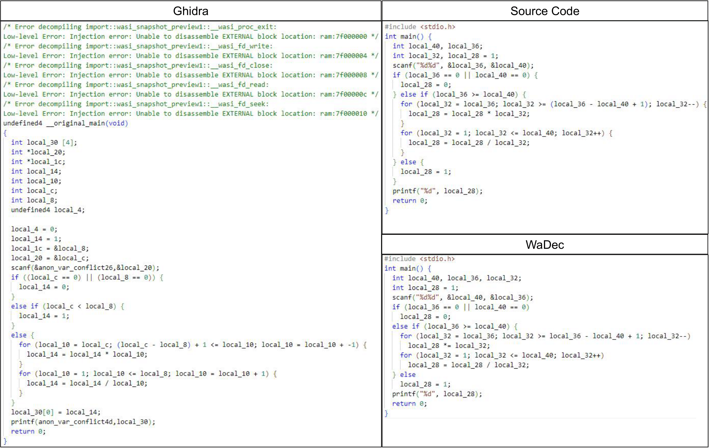

# WaDec

WaDec is an approach leveraging a fine-tuned LLM to decompile Wasm binary code into a more comprehensible source code. The model's training on a specialized **wat-c** dataset, coupled with self-supervised learning, has proven pivotal in enhancing decompilation efficacy. Our results indicate that WaDec significantly outperforms existing tools, achieving a minimal code inflation rate and maintaining high recompilability and re-execution rates. This advancement not only bolsters the readability and analyzability of Wasm code but also paves the way for more robust automated code analysis, optimization, and security auditing processes.

## Dataset

Our dataset is specifically designed for decompiling WebAssembly (Wasm). It includes100k+ pairs of WebAssembly Text (Wat) snippets and C code snippets at the loop level, providing a finer granularity than function-level datasets. The dataset has been uploaded to **Hugging Face**, and it is available at (https://huggingface.co/wadecc/FGW2C). The main features of the dataset are as follows:

- **Wat snippet**: Segmented based on loop blocks.
- **C snippet**: Segmented based on loop blocks, corresponding to wat snippet.
- **Spatial info**: Function declarations for called functions.
- **Temporal info**: Local variables already defined before current snippet.
- **Offset2string**: Mapping from offsets to string constants.

## Getting Started

### Prerequisites

Ensure you have the following prerequisites installed:

- [Python 3.x](https://www.python.org/downloads/)
- [Git](https://git-scm.com/downloads)

### Installation

Clone the repository to your local machine:

```bash
git clone https://anonymous.4open.science/r/WaDec-EDDE
cd WaDec-EDDE
```

### 1. Infering

Our fine-tuned LLM has been uploaded to **Hugging Face**, and it can be accessed via (https://huggingface.co/wadecc/Wat2c).

For infering, please run [infering.py](Scripts/infering.py):
```bash
python infering.py
  --base_model wadecc/Wat2c
  --wat_path {wat_path}
  --dst_path {output_path}
  --invoke {invoked_functions}
```
### 2. Evaluation

#### CodeBLEU
In Section 5.2 of our paper, we disscuss one of the External Threats to Validity, i.e., **the limitations of CodeBLEU**, which is detailed in -> [Limitations of CodeBLEU](Scripts/Metrics/Codebleu/README.md)

For calculating CodeBLEU scores, please run [cal_codebleu.py](Scripts/Metrics/Codebleu/cal_codebleu.py):
```
python cal_codebleu.py
  --reference {source_c}
  --prediction {decompiled_c}
  --lang c
```

#### Others
Besides, we also evaluate our method using additional metrics such as AST Edit Distance Similarity, Cosine Similarity, Cyclomatic Complexity Similarity, and code bloat rate. To compute these metrics, please run [eval.ipynb](Scripts/Metrics/Similarity_codebloat/eval.ipynb)

### 3. Comparation between WaDec and Ghidra

<p align="center">
  
</p>

We can see apparent issues with the decompilation result of the Wasm plugin in Ghidra. First, there are errors in the decompilation result, which clearly indicates that Ghidra has certain problems with decompiling Wasm. Second, by comparing Ghidra's decompilation result with the source code, we can find that Ghidra cannot recover string constants, which severely affects the semantics and I/O of the code. Moreover, compared with the source code and WaDec's output, there is a significant code bloat. Finally, there are varying degrees of inconsistencies in function names, variable types, and other aspects.

#### :)
We thank all the reviewers for the valuable feedback!
